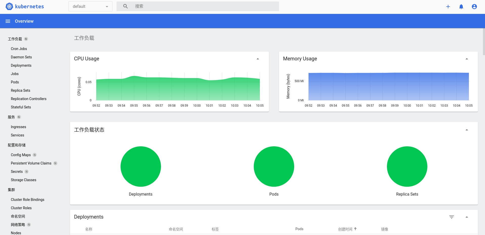
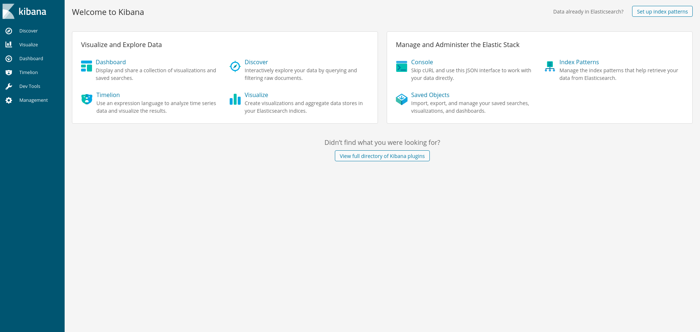
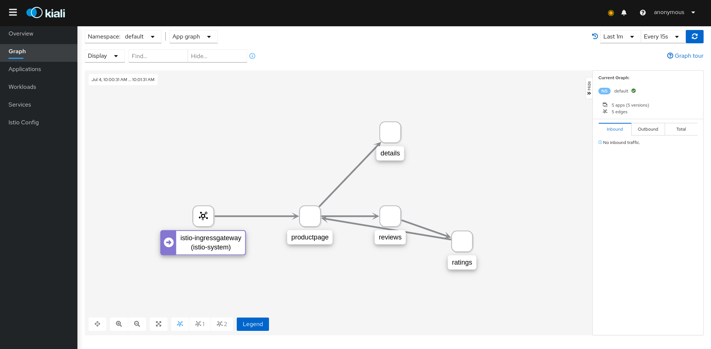
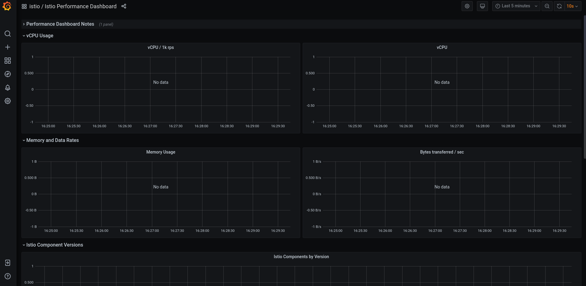
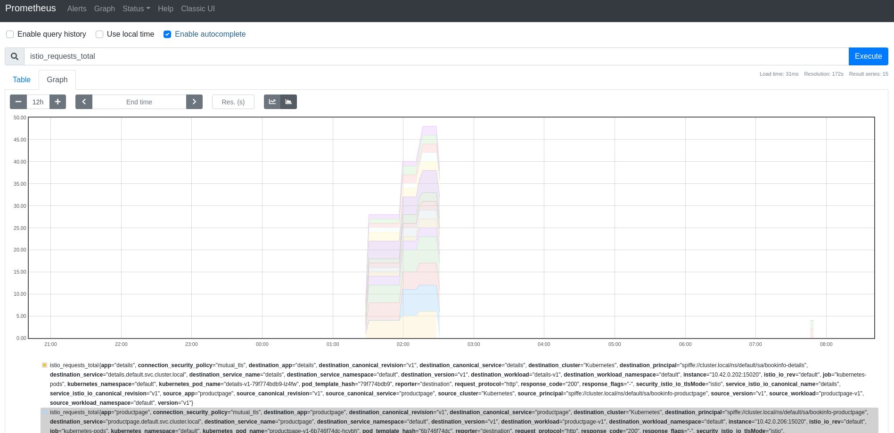
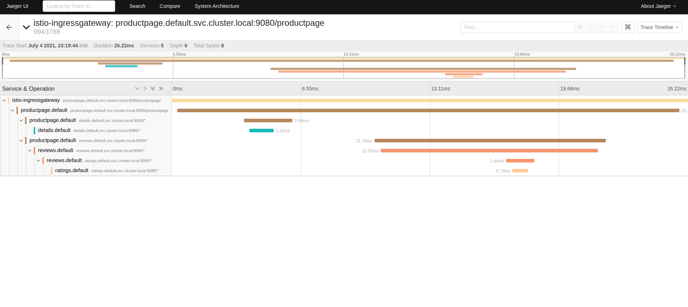

### 服务网格

我们使用istio服务网格来实现我们的微服务治理， istio是一种跟平台和语言无关的服务治理方案


> 需要了解更多istio知识可以查看https://istio.io/latest/docs/ops/deployment/architecture/


学习服务网格istio的知识拓扑图解， 通过以下的知识点去掌握整个istio服务网格的实际应用， 下面的教程只是最基本的操作。


### 安装k3s

1. 先下载镜像， 加快部署（github太慢， QAQ）  

```shell
export chifun=https://github.91chifun.workers.dev
wget ${chifun}/https://github.com//k3s-io/k3s/releases/download/v1.21.2%2Bk3s1/k3s-airgap-images-amd64.tar  
wget ${chifun}/https://github.com//k3s-io/k3s/releases/download/v1.21.2%2Bk3s1/k3s  
```

2. 本地安装k3s

```shell
sudo mkdir -p /var/lib/rancher/k3s/agent/images/
sudo cp ./k3s /usr/local/bin/
sudo cp ./k3s-airgap-images-amd64.tar /var/lib/rancher/k3s/agent/images/
sudo chmod +x /usr/local/bin/k3s
curl -sfL https://get.k3s.io | INSTALL_K3S_SKIP_DOWNLOAD=true INSTALL_K3S_EXEC="--disable traefik" \
  K3S_KUBECONFIG_MODE=644 sh -
cp /etc/rancher/k3s/k3s.yaml ~/.kube/config
```

3. 测试是否安装成功
   
```shell
[double@double nfs]$ sudo kubectl top pod --all-namespaces --use-protocol-buffers 
NAMESPACE     NAME                                      CPU(cores)   MEMORY(bytes)   
kube-system   coredns-7448499f4d-d4gkz                  5m           14Mi            
kube-system   local-path-provisioner-5ff76fc89d-v9kpq   3m           8Mi             
kube-system   metrics-server-86cbb8457f-sw47l           2m           13Mi             
```

    这里只是本地的k3s, 假如需要HA, 可以更新到最新k3s, 以及多节点管理， 这里不做多演示。

### 安装存储

    这里我们使用nfs的存储中介， 可以根据实际应用做调整

1. 开启内核模块 nfs, nfsd, rpcsec_gss_krb5 (only if Kerberos is used)

```shell
sudo modprobe {nfs,nfsd,rpcsec_gss_krb5}
```

2. 运行容器

```shell
docker run                                                       \
  -v /home/double/App/docker/nfs/data:/var/local/nfs/data        \
  -e NFS_EXPORT_0='/var/local/nfs/data  *(ro,no_subtree_check)'  \
  --cap-add SYS_ADMIN                                 \
  -p 2049:2049   -p 2049:2049/udp                     \
  -p 111:111     -p 111:111/udp                       \
  -p 32765:32765 -p 32765:32765/udp                   \
  -p 32767:32767 -p 32767:32767/udp                   \
  -d erichough/nfs-server
```

3. 安装storageclass

根据上面docker的配置修改下面的 NFS_SERVER， NFS_PATH并部署

```yaml
apiVersion: v1
kind: Namespace
metadata:
  # replace with namespace where provisioner is deployed
  name: dolphin
---
kind: Deployment
apiVersion: apps/v1
metadata:
  name: nfs-client-provisioner
  # replace with namespace where provisioner is deployed
  namespace: dolphin
spec:
  replicas: 1
  selector:
    matchLabels:
      app: nfs-client-provisioner
  strategy:
    type: Recreate
  template:
    metadata:
      labels:
        app: nfs-client-provisioner
    spec:
      serviceAccountName: nfs-client-provisioner
      containers:
        - name: nfs-client-provisioner
          image: registry.cn-shanghai.aliyuncs.com/docker_hosted/nfs-subdir-external-provisioner:v4.0.2
          volumeMounts:
            - name: nfs-client-root
              mountPath: /persistentvolumes
          env:
            - name: PROVISIONER_NAME
              value: dolphin/nfs
            - name: NFS_SERVER
              # replace with server where nfs host
              value: 172.16.10.191
            - name: NFS_PATH
              value: /home/double/App/docker/nfs/data
      volumes:
        - name: nfs-client-root
          nfs:
            # replace with server where nfs host
            server: 172.16.10.191
            path: /home/double/App/docker/nfs/data
---
kind: ServiceAccount
apiVersion: v1
metadata:
  name: nfs-client-provisioner
  # replace with namespace where provisioner is deployed
  namespace: dolphin
---
kind: ClusterRole
apiVersion: rbac.authorization.k8s.io/v1
metadata:
  name: nfs-client-provisioner-runner
  # replace with namespace where provisioner is deployed
  namespace: dolphin
rules:
  - apiGroups: [""]
    resources: ["persistentvolumes"]
    verbs: ["get", "list", "watch", "create", "delete"]
  - apiGroups: [""]
    resources: ["persistentvolumeclaims"]
    verbs: ["get", "list", "watch", "update"]
  - apiGroups: ["storage.k8s.io"]
    resources: ["storageclasses"]
    verbs: ["get", "list", "watch"]
  - apiGroups: [""]
    resources: ["events"]
    verbs: ["create", "update", "patch"]
---
kind: ClusterRoleBinding
apiVersion: rbac.authorization.k8s.io/v1
metadata:
  name: run-nfs-client-provisioner
  # replace with namespace where provisioner is deployed
  namespace: dolphin
subjects:
  - kind: ServiceAccount
    name: nfs-client-provisioner
    # replace with namespace where provisioner is deployed
    namespace: dolphin
roleRef:
  kind: ClusterRole
  name: nfs-client-provisioner-runner
  apiGroup: rbac.authorization.k8s.io
---
kind: Role
apiVersion: rbac.authorization.k8s.io/v1
metadata:
  name: leader-locking-nfs-client-provisioner
  # replace with namespace where provisioner is deployed
  namespace: dolphin
rules:
  - apiGroups: [""]
    resources: ["endpoints"]
    verbs: ["get", "list", "watch", "create", "update", "patch"]
---
kind: RoleBinding
apiVersion: rbac.authorization.k8s.io/v1
metadata:
  name: leader-locking-nfs-client-provisioner
    # replace with namespace where provisioner is deployed
  namespace: dolphin
subjects:
  - kind: ServiceAccount
    name: nfs-client-provisioner
    # replace with namespace where provisioner is deployed
    namespace: dolphin
roleRef:
  kind: Role
  name: leader-locking-nfs-client-provisioner
  apiGroup: rbac.authorization.k8s.io
---
apiVersion: storage.k8s.io/v1
kind: StorageClass
metadata:
  name: managed-nfs-storage
  # replace with namespace where provisioner is deployed
  namespace: dolphin
provisioner: dolphin/nfs # or choose another name, must match deployment's env PROVISIONER_NAME'
parameters:
  archiveOnDelete: "false"
```

### 安装dashboard

创建ServiceAccount账户 

adminuser.yaml

```yaml
apiVersion: v1
kind: ServiceAccount
metadata:
  name: admin-user
  namespace: kube-system
---
apiVersion: rbac.authorization.k8s.io/v1
kind: ClusterRoleBinding
metadata:
  name: admin-user
roleRef:
  apiGroup: rbac.authorization.k8s.io
  kind: ClusterRole
  name: cluster-admin
subjects:
  - kind: ServiceAccount 
    name: admin-user 
    namespace: kube-system
```

```shell
kubectl apply -f adminuser.yaml
kubectl -n kube-system describe secret $(kubectl -n kube-system get secret | grep admin-user | awk '{print $1}')
```

安装dashboard
```shell
kubectl apply -f https://raw.githubusercontent.com/kubernetes/dashboard/v2.2.0/aio/deploy/recommended.yaml
```

打开proxy
```shell
kubectl proxy
```

浏览器访问
http://localhost:8001/api/v1/namespaces/kubernetes-dashboard/services/https:kubernetes-dashboard:/proxy




### 安装EFK

我们通过Fluentd、Elasticsearch、Kibana来收集容器的日志信息。

```yaml
# Logging Namespace. All below are a part of this namespace.
apiVersion: v1
kind: Namespace
metadata:
  name: logging
---
# Elasticsearch Service
apiVersion: v1
kind: Service
metadata:
  name: elasticsearch
  namespace: logging
  labels:
    app: elasticsearch
spec:
  ports:
  - port: 9200
    protocol: TCP
    targetPort: db
  selector:
    app: elasticsearch
---
# Elasticsearch Deployment
apiVersion: apps/v1
kind: Deployment
metadata:
  name: elasticsearch
  namespace: logging
  labels:
    app: elasticsearch
spec:
  replicas: 1
  selector:
    matchLabels:
      app: elasticsearch
  template:
    metadata:
      labels:
        app: elasticsearch
      annotations:
        sidecar.istio.io/inject: "false"
    spec:
      containers:
      - image: docker.elastic.co/elasticsearch/elasticsearch-oss:6.1.1
        name: elasticsearch
        resources:
          # need more cpu upon initialization, therefore burstable class
          limits:
            cpu: 1000m
          requests:
            cpu: 100m
        env:
          - name: discovery.type
            value: single-node
        ports:
        - containerPort: 9200
          name: db
          protocol: TCP
        - containerPort: 9300
          name: transport
          protocol: TCP
        volumeMounts:
        - name: elasticsearch
          mountPath: /data
      volumes:
      - name: elasticsearch
        emptyDir: {}
---
# Fluentd Service
apiVersion: v1
kind: Service
metadata:
  name: fluentd-es
  namespace: logging
  labels:
    app: fluentd-es
spec:
  ports:
  - name: fluentd-tcp
    port: 24224
    protocol: TCP
    targetPort: 24224
  - name: fluentd-udp
    port: 24224
    protocol: UDP
    targetPort: 24224
  selector:
    app: fluentd-es
---
# Fluentd Deployment
apiVersion: apps/v1
kind: Deployment
metadata:
  name: fluentd-es
  namespace: logging
  labels:
    app: fluentd-es
spec:
  replicas: 1
  selector:
    matchLabels:
      app: fluentd-es
  template:
    metadata:
      labels:
        app: fluentd-es
      annotations:
        sidecar.istio.io/inject: "false"
    spec:
      containers:
      - name: fluentd-es
        image: mirrorgooglecontainers/fluentd-elasticsearch:v2.0.1
        env:
        - name: FLUENTD_ARGS
          value: --no-supervisor -q
        resources:
          limits:
            memory: 500Mi
          requests:
            cpu: 100m
            memory: 200Mi
        volumeMounts:
        - name: config-volume
          mountPath: /etc/fluent/config.d
      terminationGracePeriodSeconds: 30
      volumes:
      - name: config-volume
        configMap:
          name: fluentd-es-config
---
# Fluentd ConfigMap, contains config files.
kind: ConfigMap
apiVersion: v1
data:
  forward.input.conf: |-
    # Takes the messages sent over TCP
    <source>
      type forward
    </source>
  output.conf: |-
    <match **>
       type elasticsearch
       log_level info
       include_tag_key true
       host elasticsearch
       port 9200
       logstash_format true
       # Set the chunk limits.
       buffer_chunk_limit 2M
       buffer_queue_limit 8
       flush_interval 5s
       # Never wait longer than 5 minutes between retries.
       max_retry_wait 30
       # Disable the limit on the number of retries (retry forever).
       disable_retry_limit
       # Use multiple threads for processing.
       num_threads 2
    </match>
metadata:
  name: fluentd-es-config
  namespace: logging
---
# Kibana Service
apiVersion: v1
kind: Service
metadata:
  name: kibana
  namespace: logging
  labels:
    app: kibana
spec:
  ports:
  - port: 5601
    protocol: TCP
    targetPort: ui
  selector:
    app: kibana
---
# Kibana Deployment
apiVersion: apps/v1
kind: Deployment
metadata:
  name: kibana
  namespace: logging
  labels:
    app: kibana
spec:
  replicas: 1
  selector:
    matchLabels:
      app: kibana
  template:
    metadata:
      labels:
        app: kibana
      annotations:
        sidecar.istio.io/inject: "false"
    spec:
      containers:
      - name: kibana
        image: docker.elastic.co/kibana/kibana-oss:6.1.1
        resources:
          # need more cpu upon initialization, therefore burstable class
          limits:
            cpu: 1000m
          requests:
            cpu: 100m
        env:
          - name: ELASTICSEARCH_URL
            value: http://elasticsearch:9200
        ports:
        - containerPort: 5601
          name: ui
          protocol: TCP
---
```

访问kibana
```shell
kubectl -n logging port-forward $(kubectl -n logging get pod -l app=kibana -o jsonpath='{.items[0].metadata.name}') 5601:5601 
```

程序上有两种向fluentd提交日志的方案， 第一种是配置fluentd监听docker的日志文件并收集， 第二种是是通过tcp向fluentd提交，在istio早期版本中
/istio-1.6.0/samples/bookinfo/telemetry/fluentd-istio.yaml
可以看到有第二种方案的处理，但是在最新版本是不支持的，在官万网站中找了许久
https://discuss.istio.io/t/fluentd-logging-with-istio-1-5/6771
最好方案有待观察或者使用老版本的istio



### 安装ISTIO

1. 先下载镜像

```shell
export chifun=https://github.91chifun.workers.dev
wget ${chifun}/https://github.com//istio/istio/releases/download/1.10.2/istio-1.10.2-linux-amd64.tar.gz
```

2. 安装istio

```shell
tar zxvf istio-1.10.2-linux-amd64.tar.gz && cd istio-1.10.2 
sudo cp bin/istioctl /usr/local/bin && istioctl install --set profile=demo -y
```

开启默认注入sidecar
```shell
kubectl label namespace default istio-injection=enabled
```

查看service/istio-ingressgateway对外的nodeport，等会我们使用这个端口访问我们的bookinfo
```shell
$(kubectl -n istio-system get service istio-ingressgateway -o jsonpath='{.spec.ports[?(@.name=="http2")].nodePort}')
$(kubectl -n istio-system get service istio-ingressgateway -o jsonpath='{.spec.ports[?(@.name=="https")].nodePort}')
```

3. 安装bookinfo

安装各个组件的pod

```shell
kubectl apply -f samples/bookinfo/platform/kube/bookinfo.yaml
```

应用destination rules来路由我们的服务

```shell
kubectl apply -f samples/bookinfo/networking/bookinfo-gateway.yaml
```

验证istio是否配置正确

```shell
istioctl analyze
kubectl exec "$(kubectl get pod -l app=ratings -o jsonpath='{.items[0].metadata.name}')" -c ratings -- \
curl -sS productpage:9080/productpage | grep -o "<title>.*</title>"
```

为了让kiali绘制整个应用拓扑图， 我们提前访问集群， 由于默认的采样率是1%， 所以我们访问100次数

```shell
for i in $(seq 1 100); do curl -s -o /dev/null "http://127.0.0.1:30944/productpage"; done
```

4. 安装网格插件

在samples的用列目录下包含了许多常见的微服组件， 我们可以根据需要去分别部署。

```shell
  addons/
  ├── extras
  │   ├── prometheus-operator.yaml
  │   └── zipkin.yaml
  ├── grafana.yaml
  ├── jaeger.yaml
  ├── kiali.yaml
  └── prometheus.yaml
```

这里我们将所有的组件都启动。

```shell
kubectl apply -f samples/addons 
```

如果遇到无法下载组件可以使用下面的方式去尝试。

```shell
docker pull quay.io/kiali/kiali:v1.34
docker save -o kiali.tar quay.io/kiali/kiali:v1.34
sudo k3s ctr images import kiali.tar
```

4.1 使用kiali

kiali可以应用web界面的方式管理我们的mesh， 以及调整mesh的规则

```shell
istioctl dashboard kiali
```



4.2 使用 grafana 

```shell
istioctl dashboard grafana
```

打开浏览器

http://localhost:3000/dashboard/db/istio-service-dashboard 



4.3 使用 prometheus 

```shell
istioctl dashboard prometheus
```




4.4 使用 jaeger

```shell
istioctl dashboard jaeger
```



